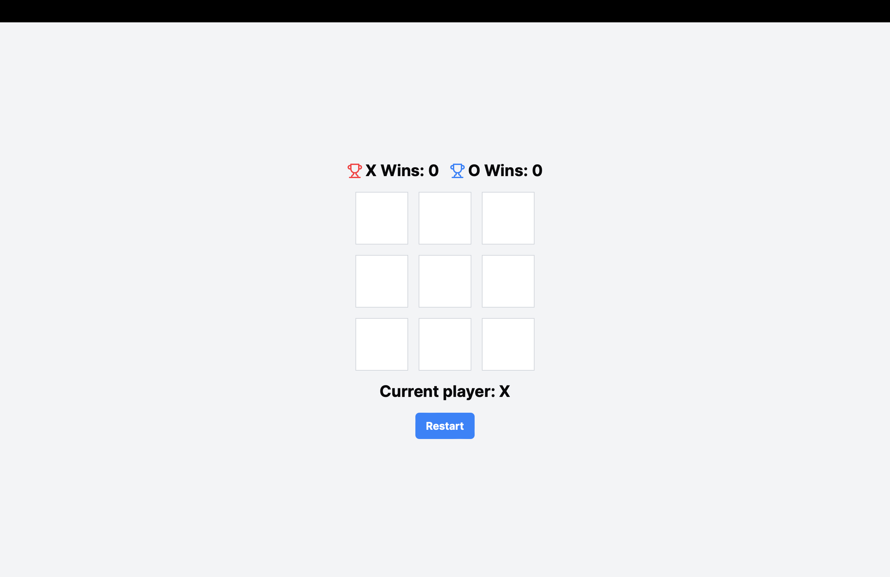

# Tic Tac Toe
## Website: [tic-tac-toe-rz.vercel.app](https://tic-tac-toe-rz.vercel.app)

## Description

"Tic Tac Toe" is a classic two-player game where the objective is to form a straight line of three of one's own marks. This version offers a modern and simple interface, allowing players to enjoy the game with friends or against an AI.

## First, run the development server:

```bash
npm run dev
# or
yarn dev
# or
pnpm dev
# or
bun dev
```

Open [http://localhost:3000](http://localhost:3000) with your browser to see the result.

## Features

- Simple and intuitive interface
- Play against a friend or AI
- Keeps track of wins for both players



